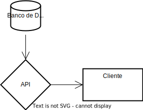
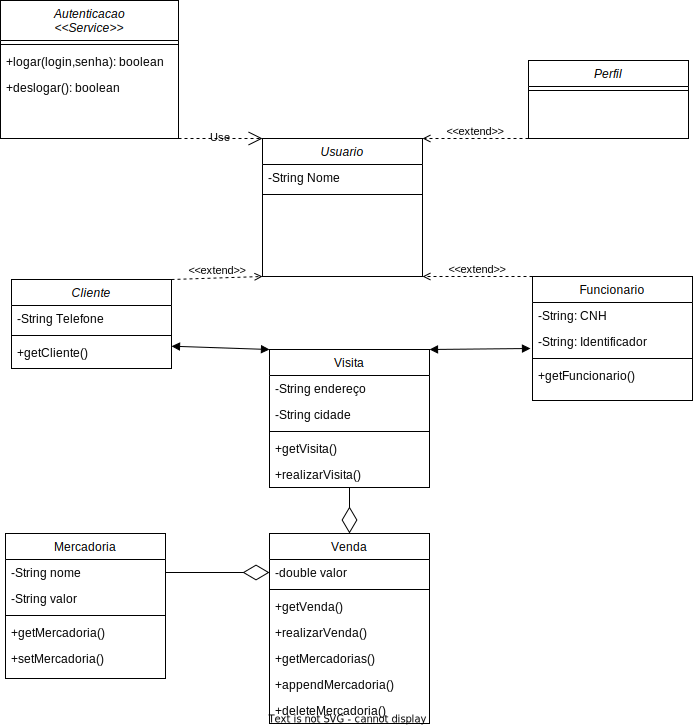

# Sales Pro

## Estrutura dos sistema

O sistema será composto de um banco de dados, uma api, um painel web para configurações dos gestores e o um aplicativado mobile.
Tecnologias propostas:

- Mysql
- React, React Native, Java ou Kotlin
- Bun + Hono + DrizzleORM

## Banco de dados

Banco de dados em MySQL utilizando estrutura de code frist com DrizzleORM.

### Diagrama conceitual

### Diagrama ER

### Dicionario de dados

## Componentes do sistema

### [API](./api/README.md)

Api RESTfull em typescript utilizando Bun + Hono + DrizzleORM.

### [Client](./client/README.md)

Interface do sistema

