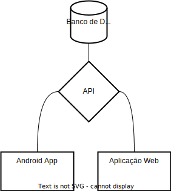

# Sales Pro
## Estrutura dos sistema
O sistema será composto de um banco de dados, uma api, um painel web para configurações dos gestores e o um aplicativado mobile.
Tecnologias propostas:
- Mysql
- React
- Bun + Hono + DrizzleORM
- Java

## Banco de dados
Banco de dados em MySQL utilizando estrutura de code frist com DrizzleORM.

### Diagrama conceitual

### Diagrama ER

### Dicionario de dados

## Componentes do sistema
### Exemplo

### [API](./api/README.md)

Api RESTfull em typescript utilizando Bun + Hono + DrizzleORM.

### [Aplicação Web](./client/README.md)

Interface simplificada para gerenciamento do sistema utilizando React.

### [Aplicativo](./app/README.md)

Aplicativo para android utilizando java.

